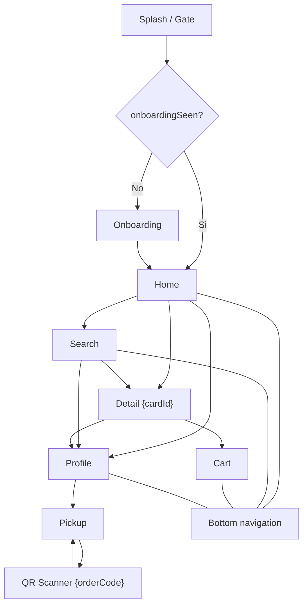
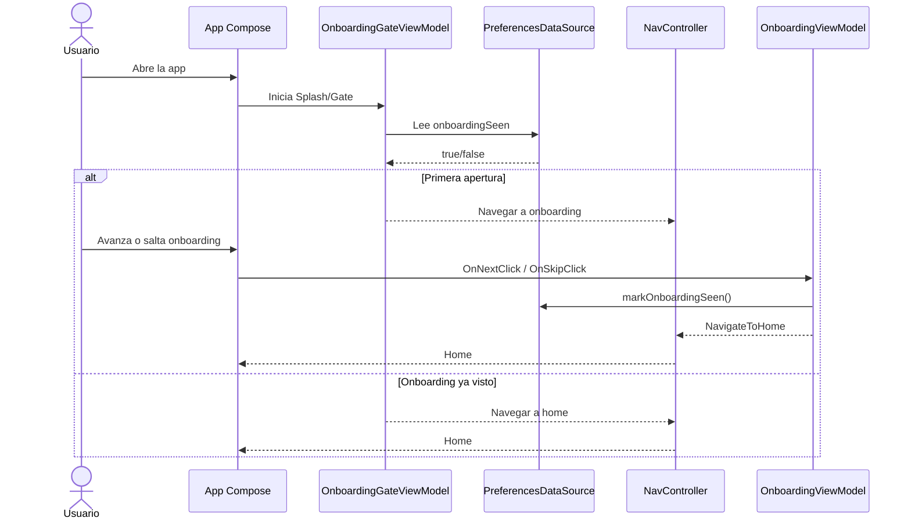
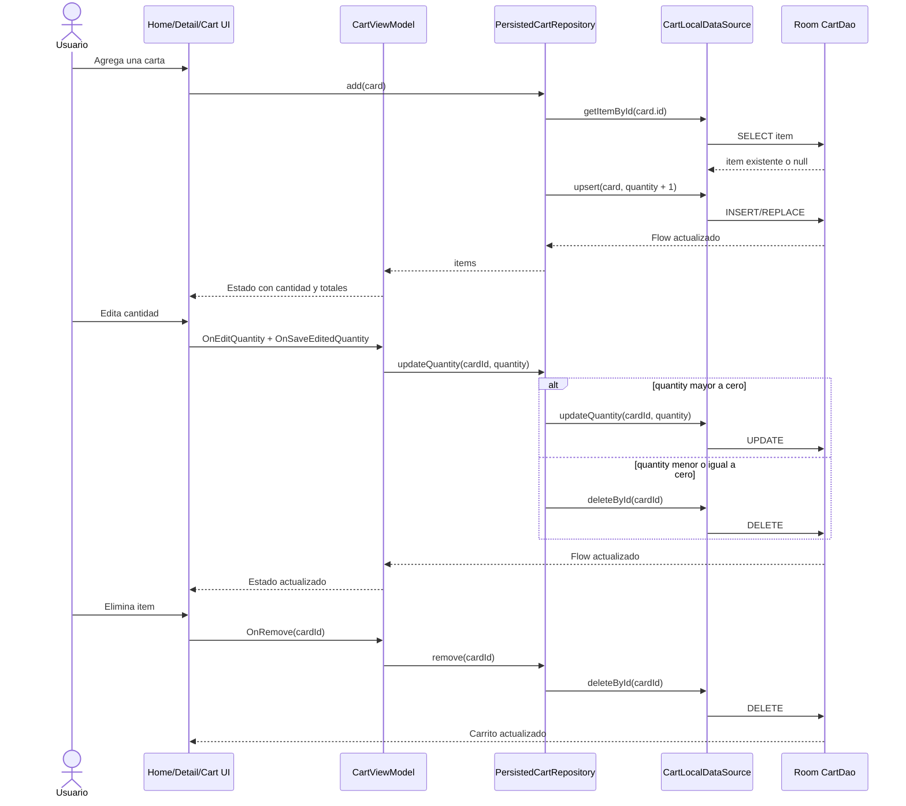
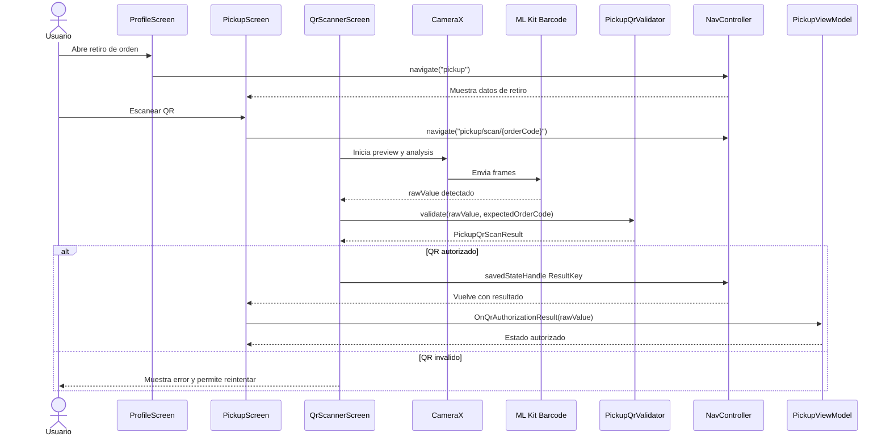

# PokeVault - Documentacion final de entrega

## Resumen del proyecto

PokeVault es una aplicacion mobile Android desarrollada en Kotlin y Jetpack Compose, integrada con un backend FastAPI. La app permite explorar cartas Pokemon, ver detalle de cada carta, gestionar un carrito persistido, iniciar sesion con Google, consultar compras y validar el retiro de una orden mediante escaneo QR.

El proyecto se organiza en dos partes principales:

- `frontend.mobile`: aplicacion Android con Compose, Navigation, Hilt, Room, DataStore, Retrofit, CameraX y ML Kit.
- `backend.Api`: API FastAPI con endpoints de Pokemon, autenticacion, vault y ordenes.

La entrega final prioriza una experiencia mobile completa y defendible: primer uso guiado, carrito persistente, flujo de pickup con QR, soporte visual moderno con dark mode/dynamic color, accesibilidad basica y tests unitarios sobre logica critica.

## Funcionalidades implementadas

### Onboarding de primera apertura

- La app inicia en un destino `Splash` que decide si mostrar onboarding o ir directo al home.
- La decision se guarda con DataStore mediante `onboardingSeen`.
- El onboarding se muestra solo en la primera apertura.
- Al finalizar o saltear, se marca como visto y se navega a `Home`.
- Al cerrar sesion, el onboarding se preserva para no volver a mostrarlo innecesariamente.

### CRUD persistido del carrito/cart

- El carrito esta persistido localmente con Room.
- Cada item guarda datos de la carta y cantidad.
- Operaciones implementadas:
  - Agregar carta al carrito.
  - Incrementar cantidad si la carta ya existe.
  - Editar cantidad desde el carrito.
  - Decrementar cantidad.
  - Eliminar item.
  - Vaciar carrito al confirmar compra.
- El estado del carrito se observa con `Flow`, por lo que la UI se actualiza ante cambios persistidos.

### Escaneo QR con CameraX para pickup/retiro/autorizacion

- El flujo de retiro se abre desde perfil/ordenes.
- La pantalla de pickup muestra informacion de la orden y acceso al scanner.
- El scanner usa CameraX para preview de camara y ML Kit Barcode Scanning para detectar QR.
- La validacion del QR esta separada en `PickupQrValidator`.
- Se aceptan formatos:
  - `PKM-A7X2`
  - `PICKUP:PKM-A7X2`
  - `POKEVAULT:PICKUP:PKM-A7X2`
- El resultado vuelve a la pantalla de pickup mediante `savedStateHandle`.

### Dark mode, dynamic color y accesibilidad

- `PokeMarketTheme` soporta modo claro y oscuro.
- En Android 12+ usa Dynamic Color del sistema cuando esta disponible.
- En versiones anteriores usa una paleta propia clara/oscura.
- Las pantallas principales consumen `MaterialTheme.colorScheme` en lugar de colores fijos.
- Mejoras de accesibilidad:
  - Descripciones para acciones relevantes como cerrar pickup, escanear QR, editar/eliminar cantidad y aumentar/disminuir cantidad.
  - Preview de camara QR con descripcion para lectores de pantalla.
  - Iconos decorativos sin descripcion para evitar ruido en TalkBack.
  - Contraste adaptado por roles semanticos de Material 3.

### Tests

- Se agregaron unit tests JVM, sin UI tests complejos.
- Los tests priorizan logica defendible y estable:
  - Repository persistido del carrito.
  - ViewModel del carrito.
  - Validador QR.
  - Estado derivado del onboarding.
- Se usan JUnit, `kotlinx-coroutines-test` y Turbine.

## Checklist de Nielsen aplicado

| Heuristica | Aplicacion en PokeVault |
| --- | --- |
| Visibilidad del estado del sistema | Estados de carga en home, search y carrito; feedback de confirmacion/procesamiento; badge de cantidad en carrito. |
| Coincidencia entre sistema y mundo real | Lenguaje orientado a compra/retiro: carrito, orden, retiro, direccion, QR de autorizacion. |
| Control y libertad del usuario | Navegacion inferior a secciones principales; volver desde scanner; cancelar dialogos; saltear onboarding. |
| Consistencia y estandares | Navigation Compose con rutas claras; Material 3; botones, cards y dialogos consistentes. |
| Prevencion de errores | Validacion de cantidad mayor a cero; QR rechazado si no corresponde a la orden esperada. |
| Reconocimiento antes que memoria | Bottom bar con iconos y labels; filtros visibles; informacion de orden y pickup en pantalla. |
| Flexibilidad y eficiencia | Persistencia del carrito; busqueda y filtros; reintento de escaneo QR. |
| Diseno estetico y minimalista | UI basada en Compose, tarjetas, jerarquia visual y paleta adaptativa clara/oscura. |
| Ayuda para reconocer y recuperarse de errores | Mensajes para fallas de login, compra, permisos y QR invalido. |
| Ayuda y documentacion | README y este documento describen configuracion, pruebas y defensa. |

## Benchmark comparativo breve

| Referente | Que resuelve bien | Diferencia con PokeVault |
| --- | --- | --- |
| Marketplace general tipo MercadoLibre | Busqueda, carrito, compra y seguimiento de orden. | PokeVault es mas acotada y especializada en cartas Pokemon, con foco academico en arquitectura mobile/backend. |
| Apps de coleccionables tipo TCGplayer/Cardmarket | Catalogo de cartas, precios y coleccionismo. | PokeVault incorpora flujo propio de pickup con QR y backend FastAPI local/deployado. |
| Apps mobile modernas Material Design | Dark mode, navegacion inferior, accesibilidad basica. | PokeVault adopta Material 3, dynamic color y tests unitarios como parte de la entrega. |

Conclusiones del benchmark:

- PokeVault toma patrones conocidos de marketplaces: catalogo, detalle, carrito y ordenes.
- El diferencial de la entrega es integrar esos patrones con persistencia local, QR de retiro y una arquitectura Android defendible.
- El alcance es universitario, por lo que se prioriza claridad, estabilidad y demostracion tecnica sobre volumen de funcionalidades.

## Mapa de navegacion



Destinos principales de bottom navigation:

- `home`
- `search`
- `cart`
- `profile`

Destinos secundarios:

- `splash`
- `onboarding`
- `detail/{cardId}`
- `pickup`
- `pickup/scan/{orderCode}`

## Diagramas de secuencia

### Flujo de onboarding



### Flujo CRUD del carrito/cart



### Flujo QR pickup



## Como probar manualmente

### Backend

1. Entrar a `backend.Api`.
2. Crear/activar entorno virtual e instalar dependencias.
3. Configurar `.env` con MySQL y `GOOGLE_WEB_CLIENT_ID`.
4. Levantar API:

```powershell
uvicorn main:app --reload --host 127.0.0.1 --port 8000
```

5. Verificar:

```text
http://127.0.0.1:8000/health
http://127.0.0.1:8000/docs
```

### Frontend Android

1. Abrir `frontend.mobile` en Android Studio.
2. Para backend local, configurar `frontend.mobile/api.properties`:

```properties
API_TARGET=local
API_BASE_URL=
```

3. Para Google Sign-In, configurar `frontend.mobile/local.properties`:

```properties
GOOGLE_WEB_CLIENT_ID=your-google-web-client-id.apps.googleusercontent.com
```

4. Ejecutar la app en emulador.

### Casos manuales sugeridos

1. Primera apertura:
   - Borrar datos de la app.
   - Abrir app.
   - Verificar que aparece onboarding.
   - Finalizar o saltear.
   - Cerrar y reabrir.
   - Verificar que entra directo al home.

2. Carrito:
   - Buscar o abrir una carta.
   - Agregar al carrito.
   - Verificar badge en bottom bar.
   - Abrir carrito.
   - Incrementar/decrementar.
   - Editar cantidad.
   - Eliminar item.
   - Cerrar y reabrir app para verificar persistencia local.

3. Pickup QR:
   - Iniciar sesion si corresponde.
   - Abrir perfil y una orden disponible para retiro.
   - Entrar al mapa/pickup.
   - Abrir scanner QR.
   - Probar un QR valido con el codigo de orden esperado.
   - Probar un QR invalido y verificar mensaje de error.

4. Dark mode y dynamic color:
   - Activar modo oscuro desde ajustes del dispositivo.
   - Recorrer home, search, detail, cart, profile, pickup y QR.
   - En Android 12+, cambiar wallpaper/color del sistema y reabrir app.
   - Verificar que los colores principales se adaptan.

5. Accesibilidad:
   - Activar TalkBack.
   - Recorrer bottom navigation, carrito, pickup y scanner.
   - Verificar que las acciones principales tienen descripcion comprensible.

## Como correr tests

Desde `frontend.mobile`:

```powershell
.\gradlew.bat :app:testDebugUnitTest
```

Tambien se puede correr build debug:

```powershell
.\gradlew.bat :app:assembleDebug
```

Tests cubiertos:

- `PersistedCartRepositoryTest`
- `CartViewModelTest`
- `PickupQrValidatorTest`
- `OnboardingUiStateTest`

## Orden sugerido para la defensa oral

1. Presentar PokeVault:
   - App Android + backend FastAPI.
   - Problema: explorar cartas, comprar/guardar carrito y retirar orden con QR.

2. Mostrar arquitectura:
   - Separacion `frontend.mobile` y `backend.Api`.
   - Android con Compose, Navigation, Hilt, Room, DataStore y Retrofit.
   - Backend FastAPI como frontera de datos.

3. Recorrer funcionalidades:
   - Onboarding de primera apertura.
   - Catalogo, detalle y carrito.
   - Persistencia local del carrito.
   - Perfil/ordenes y pickup con QR.
   - Dark mode, dynamic color y accesibilidad.

4. Profundizar en carrito:
   - Es el CRUD mas defendible.
   - Explicar `CartRepository`, `PersistedCartRepository`, `CartLocalDataSource`, `CartDao` y `CartViewModel`.
   - Mostrar que Room conserva items y cantidades.

5. Profundizar en QR:
   - CameraX para capturar.
   - ML Kit para leer codigos.
   - `PickupQrValidator` como logica testeable separada.
   - Resultado devuelto por navigation `savedStateHandle`.

6. Profundizar en UX:
   - Checklist Nielsen.
   - Modo oscuro y dynamic color.
   - Accesibilidad con content descriptions y contraste.

7. Mostrar tests:
   - Repositorio del carrito.
   - ViewModel del carrito.
   - Validador QR.
   - Estado de onboarding.
   - Ejecutar o mencionar `:app:testDebugUnitTest`.

8. Cierre:
   - Explicar alcance actual.
   - Mencionar mejoras futuras posibles: mas cobertura, UI tests instrumentados, mejor seguridad backend, CI completo.

## Explicacion tecnica breve para defensa

La app usa una arquitectura por capas. La UI Compose observa estados desde ViewModels. Los ViewModels no conocen detalles de persistencia o red; delegan en repositories. En el carrito, el repository persistido usa Room mediante un data source local y expone un `Flow<List<CartItem>>`. Esto permite que cualquier cambio de alta, edicion o baja se refleje automaticamente en la pantalla.

El onboarding usa DataStore porque es una preferencia simple de usuario. El QR separa captura de validacion: CameraX y ML Kit se encargan de obtener el valor crudo, mientras `PickupQrValidator` decide si corresponde a la orden esperada. Esa separacion facilita testear la regla sin camara ni emulador.

Para UX, el tema centralizado en Material 3 permite soportar modo claro, modo oscuro y dynamic color sin duplicar estilos por pantalla. Las mejoras de accesibilidad se enfocan en acciones importantes y en reducir ruido de iconos decorativos.

La base de tests se concentra en logica critica y estable, evitando UI tests complejos que requieren emulador. Esto hace que los tests sean rapidos, mantenibles y adecuados para una entrega universitaria.
